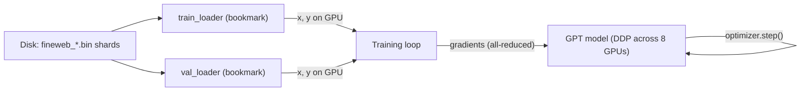
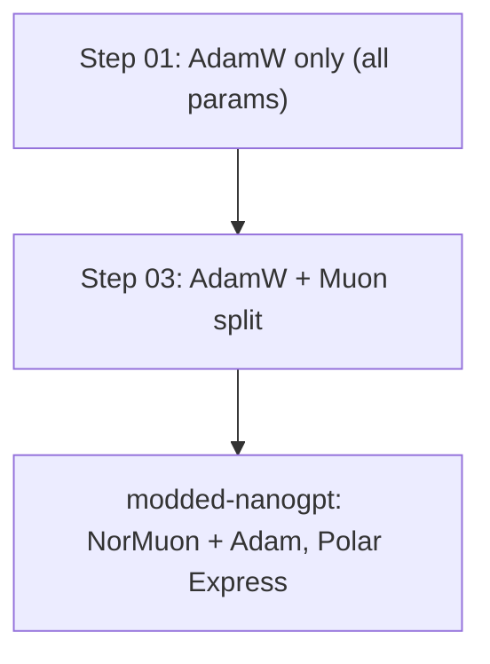
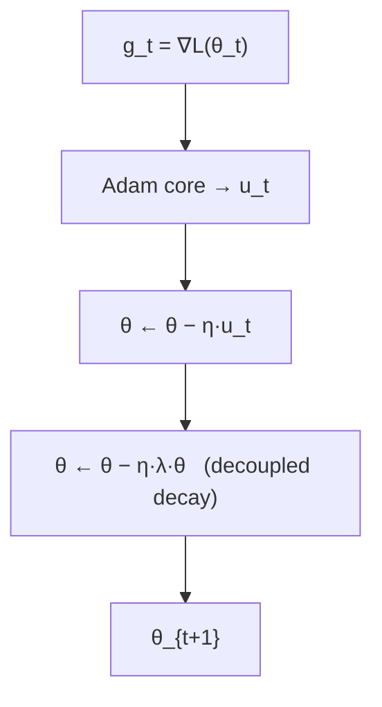
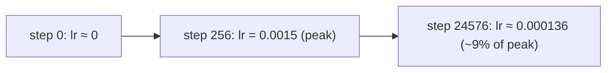
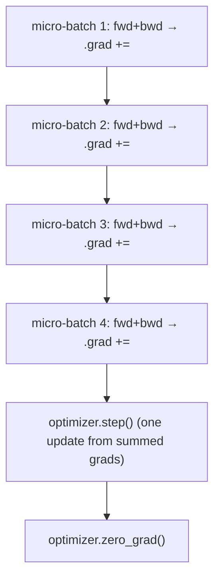
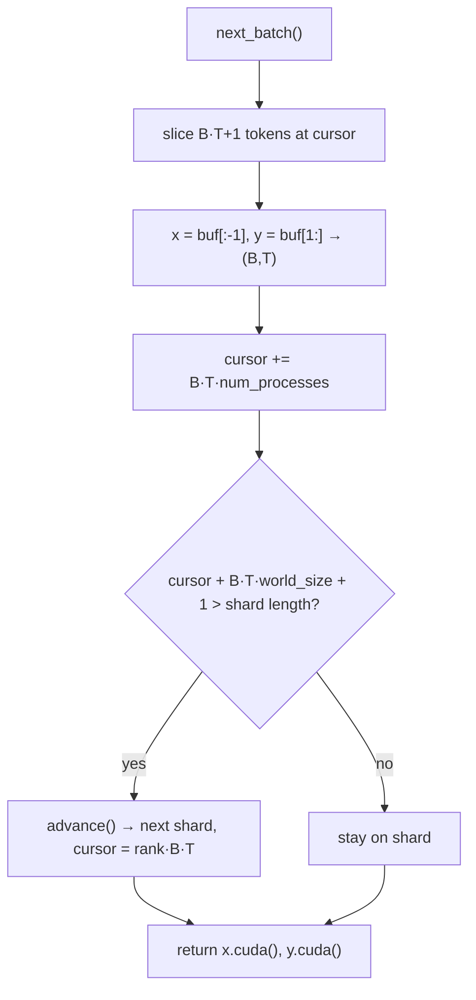
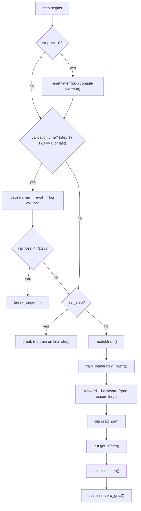

# NanoGPT Speedrun — DDP, Optimizers, Learning Rate & Data Loading

A detailed walkthrough of how the baseline speedrun trainer actually works, built around real code in this repo. Everything here refers to:

- **Training script:** [`nanogpt-speedrun/src/runfiles/01-Initialbaseline/train_gpt2.py`](../../nanogpt-speedrun/src/runfiles/01-Initialbaseline/train_gpt2.py)
- **Launch script:** [`nanogpt-speedrun/src/runfiles/01-Initialbaseline/run.sh`](../../nanogpt-speedrun/src/runfiles/01-Initialbaseline/run.sh)
- **Data format writer:** [`nanogpt-speedrun/src/data/fineweb.py`](../../nanogpt-speedrun/src/data/fineweb.py)

> Note on math rendering: GitHub markdown does not render LaTeX by default. Equations below are written in **plain-text / Unicode** so they read correctly anywhere. A LaTeX copy for Notion/Overleaf is included at the end.

---

## Table of contents

1. [The whole system at a glance](#1-the-whole-system-at-a-glance)
2. [Model size: Tyler vs modded](#2-model-size-tyler-vs-modded)
3. [The optimizer: AdamW (and where Muon appears)](#3-the-optimizer-adamw-and-where-muon-appears)
4. [Adam vs AdamW](#4-adam-vs-adamw)
5. [The learning-rate schedule](#5-the-learning-rate-schedule)
6. [Global batch size, grad accumulation: 1 vs 4](#6-global-batch-size-grad-accumulation-1-vs-4)
7. [The data format: magic number and shards](#7-the-data-format-magic-number-and-shards)
8. [The DistributedDataLoader](#8-the-distributeddataloader)
9. [Full flow: training and validation](#9-full-flow-training-and-validation)
10. [step_avg and timing](#10-step_avg-and-timing)
11. [LaTeX appendix](#11-latex-appendix)

---

## 1. The whole system at a glance

There are three actors:

1. **`.bin` files on disk** — raw GPT-2 token streams (FineWeb).
2. **Two `DistributedDataLoader` objects** — one for training, one for validation. They are just *bookmarks* into a token stream.
3. **The training loop** — the `for step in range(...)` that orchestrates data → forward → backward → optimizer step.



**DDP (Distributed Data Parallel)** means: each of the 8 GPUs runs its own copy of the model on its own slice of data, and gradients are averaged across GPUs during `backward()` so all copies stay identical.

---

## 2. Model size: Tyler vs modded

| Track | Model | Layers | Heads | Width | Vocab | Params |
|-------|--------|--------|-------|-------|-------|--------|
| **Tyler** (`nanogpt-speedrun`) | GPT-2 small **d12** | 12 | 12 | 768 | 50,304 | **~124M** |
| **Modded** (`modded-nanogpt`) | Modded GPT | 11 | 6 | 768 (head_dim 128) | 50,304 | **~500M** (many extra embeds) |

- Tyler's `d12` config: `n_layer=12, n_head=12, n_embd=768, vocab_size=50304`. This is the classic GPT-2 small (~124M) size.
- Modded is *not* apples-to-apples: it adds 5 value-embedding tables, a bigram embedding, attention/MLP banks, gates and scalars. Both train toward the **same validation loss target (3.28)**, not the same parameter budget.

Vocab is padded from 50,257 to **50,304** (nearest multiple of 128) for GPU efficiency.

---

## 3. The optimizer: AdamW (and where Muon appears)

The baseline (step 01) uses **only AdamW** on all parameters:

```python
def configure_optimizers(self, weight_decay, learning_rate, betas, device_type):
    optimizer = torch.optim.AdamW(self.parameters(), lr=learning_rate,
                                  weight_decay=weight_decay, betas=betas)
    return optimizer
```

- One optimizer, all parameters, `betas=(0.9, 0.95)`.
- **No Muon, no NorMuon, no Polar Express** in step 01.
- **Muon is introduced in step 03** (`03-MuonOptimizer`), where the code splits into two optimizers: AdamW on `lm_head`/embeddings and Muon on the transformer blocks.



---

## 4. Adam vs AdamW

Both adapt the learning rate **per parameter** using running estimates of the gradient (first moment) and its square (second moment). The difference is **how weight decay is applied**.

### Notation

- `θ` = parameters, `g` = gradient, `η` = learning rate
- `λ` = weight decay, `β1, β2` = moment decays (0.9, 0.95 here), `ε` ≈ 1e-8
- `m` = first moment, `v` = second moment

### The shared Adam core

```
m_t = β1 · m_{t-1} + (1 - β1) · g_t
v_t = β2 · v_{t-1} + (1 - β2) · (g_t ⊙ g_t)      # ⊙ = elementwise

m̂_t = m_t / (1 - β1^t)      # bias correction
v̂_t = v_t / (1 - β2^t)

u_t = m̂_t / ( sqrt(v̂_t) + ε )                    # adaptive update direction
```

### The difference (weight update)

**AdamW — decoupled weight decay (what this repo uses):**

```
θ_{t+1} = θ_t  −  η · u_t  −  η · λ · θ_t
        = (1 − η·λ) · θ_t  −  η · u_t
```

**Classic Adam — L2 folded into the gradient:**

```
g_t ← g_t + λ · θ_t          # decay mixed into gradient first
(then run the Adam core on this modified g_t)
θ_{t+1} = θ_t − η · u_t
```



| | Adam (L2 in gradient) | AdamW (decoupled) |
|---|-----------------------|-------------------|
| Gradient used | `g + λθ` then Adam | raw `g` then Adam |
| Weight decay | scaled by adaptive terms | applied directly to `θ` |
| Modern default for transformers | less common | **yes** |
| PyTorch class | `torch.optim.Adam` | `torch.optim.AdamW` |

**Takeaway:** AdamW treats "learn from data" and "shrink weights" as two independent knobs. It is the standard for GPT-style training.

---

## 5. The learning-rate schedule

Function in the baseline:

```python
def get_lr(it):
    assert it <= args.num_iterations
    # 1) linear warmup for warmup_iters steps
    if it < args.warmup_iters:
        return args.learning_rate * (it + 1) / args.warmup_iters
    # 2) linear decay down to a floor (~9% of max)
    decay_ratio = (it - args.warmup_iters) / (args.num_iterations - args.warmup_iters)
    assert 0 <= decay_ratio <= 1
    return (0.1 + (1 - decay_ratio)) / (0.1 + 1) * args.learning_rate
```

> The comment says "cosine" but the code is actually **linear warmup → linear decay to a floor**, not cosine.

The real values come from `run.sh`, not the argparse defaults:

| Arg | argparse default | Real value in `run.sh` |
|-----|------------------|------------------------|
| `learning_rate` | 1e-4 | **0.0015** |
| `warmup_iters` | 0 | **256** |
| `num_iterations` | 10 (quick test) | **24576** |

### Phase A — warmup (`step < warmup_iters`)

```
lr(step) = lr_max × (step + 1) / warmup_iters
```

| step | lr (lr_max=0.0015, warmup=256) |
|------|-------------------------------|
| 0 | 0.0015 × 1/256 ≈ 0.0000059 |
| 255 | 0.0015 (peak) |

### Phase B — decay (`step >= warmup_iters`)

```
decay_ratio = (step - warmup_iters) / (num_iterations - warmup_iters)
lr(step)    = ((0.1 + (1 - decay_ratio)) / 1.1) × lr_max
```

| when | lr |
|------|-----|
| start of decay (step 256) | 1.0 × lr_max = 0.0015 |
| end (step 24576) | (0.1/1.1) × lr_max ≈ 0.000136 |

So the LR ramps **up** to 0.0015 over 256 steps, then **linearly decays** to ~9% of peak by the end. It never reaches zero.



ASCII shape:

```
lr
0.0015 |        ______
       |       /      \______
       |      /              \______
       |     /                      \______
       |    /                              \___
0.0001 |___/                                   
       +----|--------------------------------|----> step
           256                             24576
        warmup            linear decay
```

**Common confusion:** `num_iterations = 10` (the argparse default) does **not** turn on warmup. Warmup length is controlled solely by `warmup_iters`. The `10` you see elsewhere in the loop is a **timing** thing (see §10), not the LR.

---

## 6. Global batch size, grad accumulation: 1 vs 4

### The core identity

Every optimizer step, the model should see this many tokens:

```
tokens_per_step = B × T × num_GPUs × grad_accum_steps
```

The script enforces it:

```python
tokens_per_fwdbwd = B * T * ddp_world_size * grad_accum_steps
assert args.total_batch_size == tokens_per_fwdbwd
```

With `run.sh` on 8× H100:

```
32 × 1024 × 8 × 1 = 262,144  == --total_batch_size
```

### Why grad_accum = 1 here

`run.sh` explains it directly:

```
# Scaled to 8 GPUs: keep total_batch_size=262144 by dropping grad_accum_steps 4→1
# (32 * 1024 * 8 * 1 == 262144)
```

The original recipe was tuned with a smaller GPU count and **grad_accum=4**. Scaling to 8 GPUs lets you get the same 262,144-token global batch **in parallel**, so you drop accumulation to 1.

| Setup | GPUs | B | T | grad_accum | tokens/step |
|-------|------|---|---|------------|-------------|
| Original-style | 2 | 32 | 1024 | 4 | 262,144 |
| This run (8×H100) | 8 | 32 | 1024 | 1 | 262,144 |

Same math, different **where** the tokens come from:

- **grad_accum=4 on 2 GPUs:** each GPU runs 4 sequential micro-batches, then one `optimizer.step()`.
- **grad_accum=1 on 8 GPUs:** each GPU runs 1 forward/backward; DDP adds the other GPUs' gradients.

### When you WOULD use grad_accum > 1

When you want a **large global batch** but each GPU's memory is **too small** for its share. Grad accum trades **time for memory** — it does not reduce total compute.

Example: you want 262,144 tokens/step but `B=32` OOMs. Drop the micro-batch and accumulate:

```
Before (fits):  B=32, grad_accum=1  → 32 × 1024 × 8 × 1 = 262,144
After  (OOM):   B=16, grad_accum=2  → 16 × 1024 × 8 × 2 = 262,144
Smaller GPUs:   B=8,  grad_accum=4  →  8 × 1024 × 8 × 4 = 262,144
```

Each GPU then runs several **thin** forward/backward passes, summing gradients, then a single step:



**Intuition (homework analogy):**
- grad_accum=1: read all 262k tokens, hand in one sheet, grade updated once.
- grad_accum=4: read 65k tokens ×4, add up what you learned, then grade updated once.

Same total reading; smaller chunks fit the desk (GPU memory); more trips (slower wall-clock).

The code loop that implements this:

```python
for i, (micro_x, micro_y) in enumerate(zip(x.chunk(grad_accum_steps, dim=0),
                                           y.chunk(grad_accum_steps, dim=0))):
    _, loss = ddp_model(micro_x, micro_y, return_logits=False)
    train_loss = loss.detach()
    loss.backward()
# ... after the loop: clip, set lr, optimizer.step(), zero_grad()
```

With `grad_accum_steps=1` this loop runs exactly once.

---

## 7. The data format: magic number and shards

Each `.bin` shard begins with a **1024-byte header** (256 int32) then the tokens:

```
┌────────────────────────────────────────────────┐
│  HEADER: 256 int32  (1024 bytes)                │
│    [0] = 20240520   ← "magic": correct format?  │
│    [1] = 1          ← version                    │
│    [2] = N          ← number of tokens following │
│    [3..255] = 0     ← reserved                    │
├────────────────────────────────────────────────┤
│  BODY: N × uint16   ← the token IDs              │
└────────────────────────────────────────────────┘
```

The writer stamps it:

```python
header = np.zeros(256, dtype=np.int32)
header[0] = 20240520 # magic
header[1] = 1        # version
header[2] = len(toks) # number of tokens
```

### What is `20240520`?

- A **magic number** = a file-format signature, like `%PDF` at the start of a PDF.
- It reads as a **date, 2024-05-20** — the convention (inherited from Karpathy's llm.c / NanoGPT / modded-nanogpt) is to pick the format's definition date so it's memorable and unlikely to appear by accident.
- It is **not** a token count, hyperparameter, or anything the model learns.

Purpose: **fail fast** if you point the trainer at the wrong file, a corrupt file, or an old format.

Two readers:

```python
def _peek_data_shard(filename):
    # reads ONLY the 1024-byte header; validates magic; returns token count
    with open(filename, "rb") as f:
        header = np.frombuffer(f.read(256*4), dtype=np.int32)
    if header[0] != 20240520:
        print("ERROR: magic number mismatch in the data .bin file!")
        ...
        exit(1)
    assert header[1] == 1
    return header[2]

def _load_data_shard(filename):
    # reads header + ALL tokens into a CPU numpy array
    with open(filename, "rb") as f:
        header = np.frombuffer(f.read(256*4), dtype=np.int32)
        assert header[0] == 20240520
        assert header[1] == 1
        ntok = header[2]
        tokens = np.frombuffer(f.read(), dtype=np.uint16)
    assert len(tokens) == ntok
    return tokens
```

- **peek** = read the label only (fast, used at startup to count tokens).
- **load** = pour the whole box into RAM (used when a shard becomes active).

Tokens are `uint16` because the GPT-2 vocab (≤ 65,536) fits in 16 bits.

---

## 8. The DistributedDataLoader

A loader is just a **bookmark** into the token stream. Three fields matter: `current_shard`, `current_position`, and the loaded `tokens` array.

### Construction

```python
def __init__(self, filename_pattern, B, T, process_rank, num_processes):
    self.process_rank = process_rank
    self.num_processes = num_processes
    self.B, self.T = B, T
    self.files = sorted(glob.glob(filename_pattern))   # deterministic order
    assert len(self.files) > 0
    ntok_total = 0
    for fname in self.files:
        shard_ntok = _peek_data_shard(fname)           # validate + count
        assert shard_ntok >= num_processes * B * T + 1 # big enough for all GPUs
        ntok_total += shard_ntok
    self.ntok_total = ntok_total
    self.reset()                                        # load shard 0
```

Two loaders are built (note the different per-GPU batch width):

```python
train_loader = DistributedDataLoader(args.input_bin, B * grad_accum_steps, T, ddp_rank, ddp_world_size)
val_loader   = DistributedDataLoader(args.input_val_bin, B, T, ddp_rank, ddp_world_size)
```

### reset vs advance

```python
def reset(self):
    self.current_shard = 0
    self.current_position = self.process_rank * self.B * self.T
    self.tokens = _load_data_shard(self.files[self.current_shard])

def advance(self):  # move to next shard
    self.current_shard = (self.current_shard + 1) % len(self.files)
    self.current_position = self.process_rank * self.B * self.T
    self.tokens = _load_data_shard(self.files[self.current_shard])
```

| | `reset()` | `advance()` |
|---|-----------|-------------|
| Shard | jump to **0** | **next** (wraps with `%`) |
| Cursor | `rank × B × T` | `rank × B × T` |
| Load file | yes | yes |

**Staggered start per GPU** — each rank begins at a different offset so no two GPUs read the same tokens:

```
Token stream (each block = B×T tokens):
┌─────┬─────┬─────┬─────┬─────┬─────┬─────┬─────┬─────┬ ...
│ r0  │ r1  │ r2  │ r3  │ r4  │ r5  │ r6  │ r7  │ r0  │
└─────┴─────┴─────┴─────┴─────┴─────┴─────┴─────┴─────┴ ...
 pos=0  B·T  2B·T                    7B·T   next round
```

### next_batch — the heart

```python
def next_batch(self):
    B, T = self.B, self.T
    buf = self.tokens[self.current_position : self.current_position + B*T + 1]
    buf = torch.tensor(buf.astype(np.int32), dtype=torch.long)
    x = (buf[:-1]).view(B, T)   # inputs
    y = (buf[1:]).view(B, T)    # targets (shifted by one)
    self.current_position += B * T * self.num_processes    # jump over ALL GPUs
    if self.current_position + (B * T * self.num_processes + 1) > len(self.tokens):
        self.advance()          # shard exhausted → next file
    return x.cuda(), y.cuda()
```

**Why `+1` token?** Targets are inputs shifted by one:

```
buf = [ t0 t1 t2 ... t(BT-1) t(BT) ]   length B·T + 1
x = buf[:-1] = [t0 ... t(BT-1)]  → (B, T)   "context"
y = buf[1:]  = [t1 ... t(BT)  ]  → (B, T)   "next token to predict"
```

**Why cursor += `B·T·num_processes`?** So the next round skips over every GPU's chunk — no overlap:

```
Step k:    r0 [0·BT..]  r1 [1·BT..] ... r7 [7·BT..]   then cursor += 8·B·T
Step k+1:  r0 [8·BT..]  r1 [9·BT..] ...
```

**advance() is called only inside next_batch()** — when the next step would overrun the current shard.



---

## 9. Full flow: training and validation

### The loop skeleton

```python
train_loader.reset()
for step in range(args.num_iterations + 1):      # 0 .. 24576
    last_step = (step == args.num_iterations)
    if step == 10:                               # skip compile warmup for timing
        training_time_ms = 0
        t0 = time.perf_counter()
    timed_steps = float('nan') if step <= 11 else (step - 10) + 1

    # ---- validation (every val_loss_every steps, and on last step) ----
    if (args.val_loss_every > 0 and (step % args.val_loss_every == 0 or last_step)) and val_loader:
        torch.cuda.synchronize()
        training_time_ms += 1000 * (time.perf_counter() - t0)   # pause clock
        model.eval()
        val_loader.reset()                       # always restart val from shard 0
        with torch.no_grad():
            val_loss = 0.0
            for _ in range(args.val_max_steps):  # 20 batches
                x_val, y_val = val_loader.next_batch()
                _, loss = ddp_model(x_val, y_val, return_logits=False)
                val_loss += loss.item()
            val_loss /= args.val_max_steps
        # ... log ...
        if val_loss <= SPEEDRUN_TARGET:          # 3.28 → done
            break
        torch.cuda.synchronize(); t0 = time.perf_counter()   # resume clock

    if last_step:
        break                                    # final step is val-only

    # ---- training ----
    model.train()
    x, y = train_loader.next_batch()
    with ctx:                                    # bfloat16 autocast
        for i, (micro_x, micro_y) in enumerate(zip(x.chunk(grad_accum_steps, dim=0),
                                                   y.chunk(grad_accum_steps, dim=0))):
            _, loss = ddp_model(micro_x, micro_y, return_logits=False)
            train_loss = loss.detach()
            loss.backward()
    norm = torch.nn.utils.clip_grad_norm_(model.parameters(), args.grad_clip)
    lr = get_lr(step)
    for pg in optimizer.param_groups:
        pg['lr'] = lr
    optimizer.step()
    optimizer.zero_grad(set_to_none=True)
```

### Order inside one step



### Who calls which loader method

| Method | Called by | How often |
|--------|-----------|-----------|
| `__init__` → `reset()` | building each loader | once per loader |
| `train_loader.reset()` | before the loop | once |
| `train_loader.next_batch()` | training section | ~every step |
| `val_loader.reset()` | start of every eval | every `val_loss_every` steps |
| `val_loader.next_batch()` | val inner loop | `val_max_steps` (20) per eval |
| `advance()` | **inside `next_batch()` only** | when a shard empties |

### Two streams over time

```
TRAIN STREAM (reset once, then marches forward and wraps shards):
train_loader:  ▮▮▮▮▮▮▮▮▮▮▮▮▮▮▮▮▮▮▮▮▮▮▮▮▮▮▮▮▮▮ →→→
                 ↑s0 ↑s1 ↑s2 ...

VAL STREAM (reset to the start on EVERY eval):
val_loader:    ▮▮▮▮▮   ▮▮▮▮▮   ▮▮▮▮▮  ...
               |←20→|  |←20→|  |←20→|
               eval@0  eval@128 eval@256
```

- **Training:** one continuous read; cursor never reset during the loop; `advance()` rolls to the next shard automatically.
- **Validation:** always `reset()` first, so it measures the **same opening slice** every time → comparable numbers. Uses `torch.no_grad()`, pauses the clock, and does not touch the train loader.

### Sequence view

```mermaid
sequenceDiagram
    participant Loop as Training loop
    participant TL as train_loader
    participant VL as val_loader
    participant M as GPT (DDP)

    Note over Loop: train_loader.reset() once
    Loop->>Loop: step = 0
    Loop->>VL: reset()
    loop 20 times
        VL->>Loop: next_batch() → x_val, y_val
        Loop->>M: forward (no_grad) → loss
    end
    Note over Loop: log val_loss, maybe break
    Loop->>TL: next_batch() → x, y
    Loop->>M: forward + backward
    M-->>Loop: gradients (all-reduced across GPUs)
    Loop->>M: optimizer.step()
    Note over Loop: repeat ... last step = val only → break
```

---

## 10. step_avg and timing

Speed metrics deliberately exclude the first ~10 steps (they are slow due to `torch.compile`):

```python
if step == 10:
    training_time_ms = 0
    t0 = time.perf_counter()
timed_steps = float('nan') if step <= 11 else (step - 10) + 1
```

Then per training step:

```python
approx_time = training_time_ms + 1000 * (time.perf_counter() - t0)
# logged as:  step_avg = approx_time / timed_steps
```

- **`step_avg`** = average **milliseconds per training step** (cumulative), after dropping compile-heavy early steps.
- It tends to **rise** early then flatten as more normal steps are averaged in.
- It is a **speed benchmark** — unrelated to loss or learning rate. Lower = faster.
- Validation time is excluded because the clock is paused around eval.

---

## 11. LaTeX appendix

For Notion / Overleaf / any math-enabled renderer:

```latex
% Adam moments
m_t = \beta_1 m_{t-1} + (1-\beta_1) g_t
v_t = \beta_2 v_{t-1} + (1-\beta_2)\,(g_t \odot g_t)

% Bias correction
\hat{m}_t = \frac{m_t}{1-\beta_1^t}, \qquad \hat{v}_t = \frac{v_t}{1-\beta_2^t}

% Adam direction
u_t = \frac{\hat{m}_t}{\sqrt{\hat{v}_t} + \epsilon}

% AdamW (decoupled weight decay)
\theta_{t+1} = \theta_t - \eta\,u_t - \eta\,\lambda\,\theta_t
             = (1 - \eta\lambda)\,\theta_t - \eta\,u_t

% Classic Adam (L2 in gradient) — NOT AdamW
g_t \leftarrow g_t + \lambda\theta_t \quad\text{then run Adam on modified } g_t

% LR schedule (linear warmup, linear decay to floor)
\text{warmup: } lr(t) = lr_{max}\cdot \frac{t+1}{\text{warmup\_iters}}
\text{decay:  } lr(t) = \frac{0.1 + (1 - d)}{1.1}\, lr_{max}, \quad
d = \frac{t - \text{warmup\_iters}}{\text{num\_iterations} - \text{warmup\_iters}}

% Global batch identity
\text{tokens\_per\_step} = B \cdot T \cdot \text{num\_GPUs} \cdot \text{grad\_accum\_steps}
```

---

## Quick reference cheat sheet

| Concept | Answer |
|---------|--------|
| Optimizer (step 01) | AdamW only, all params, betas (0.9, 0.95) |
| Muon | Introduced in step 03, not step 01 |
| Adam vs AdamW | AdamW applies weight decay directly to weights (decoupled) |
| LR schedule | Linear warmup (256 steps) → linear decay to ~9% of peak |
| Peak LR | 0.0015 (from run.sh, not the 1e-4 argparse default) |
| Global batch | B·T·GPUs·grad_accum = 262,144 tokens/step |
| grad_accum = 1 | 8 GPUs already supply the full batch in parallel |
| grad_accum > 1 | Use when a micro-batch won't fit in GPU memory |
| Magic number | 20240520 (date 2024-05-20) = valid shard format |
| `reset()` | Point loader at shard 0, cursor = rank·B·T |
| `advance()` | Next shard (wraps); only called inside `next_batch()` |
| `next_batch()` | Slice B·T+1 → x,y → cursor += B·T·GPUs → maybe advance → .cuda() |
| Train reset | Once before loop (cursor flows forever) |
| Val reset | Every eval (re-measures same slice) |
| Last step | Validation only, then break |
| step_avg | Avg ms/step, excludes first ~10 compile steps |
