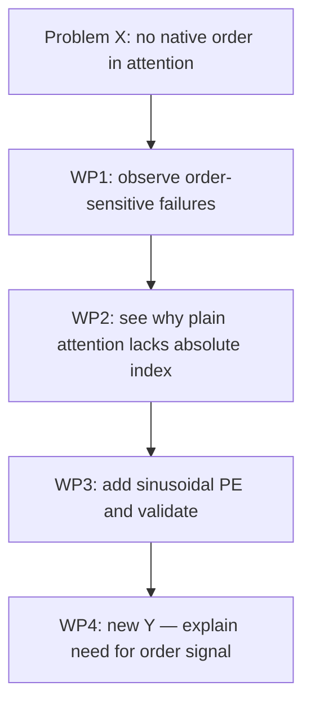
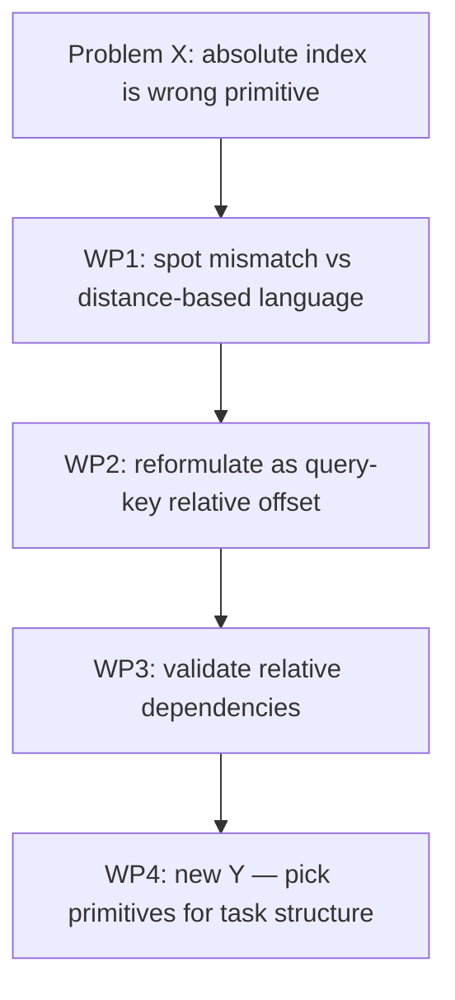
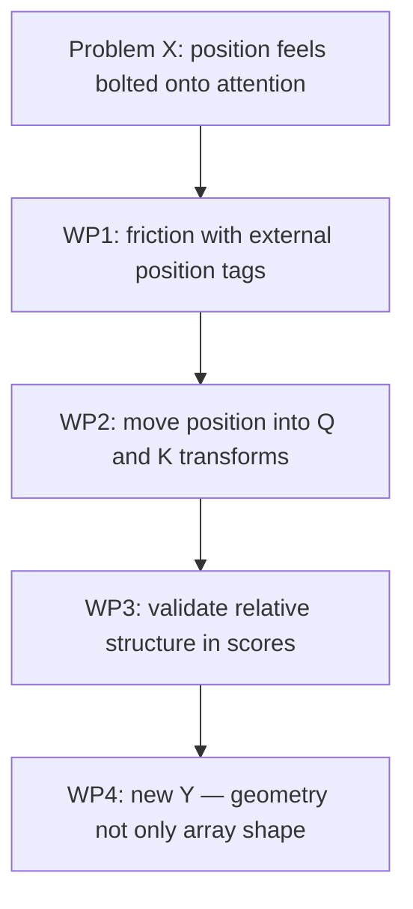
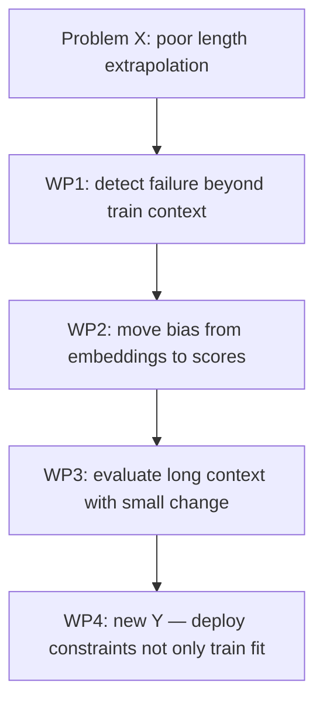
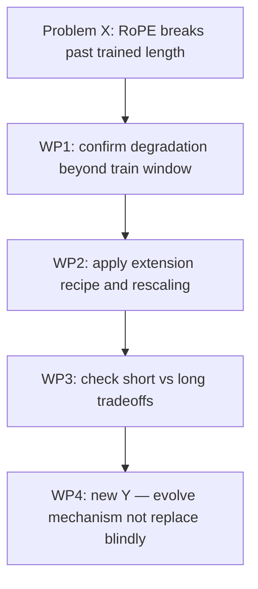
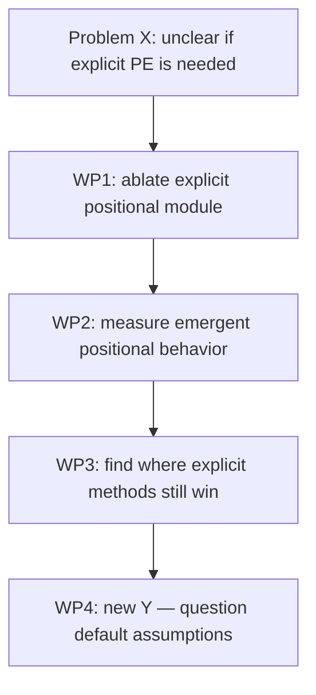
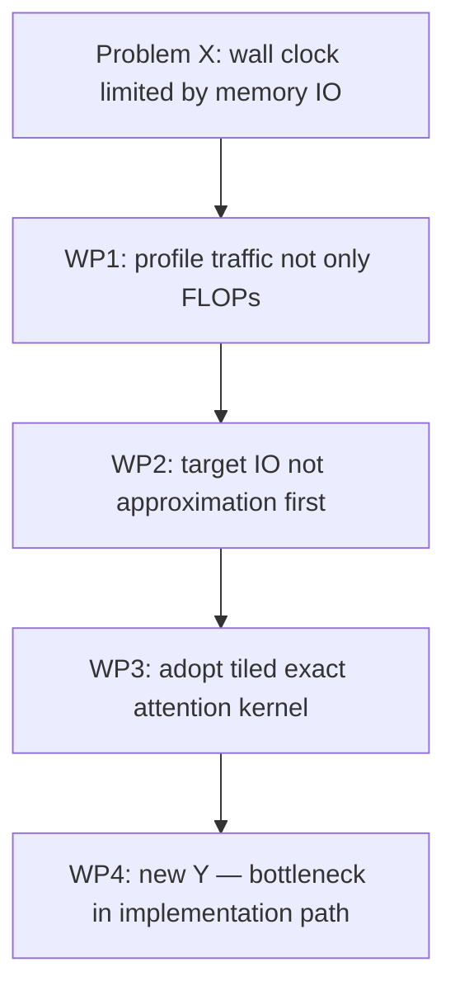
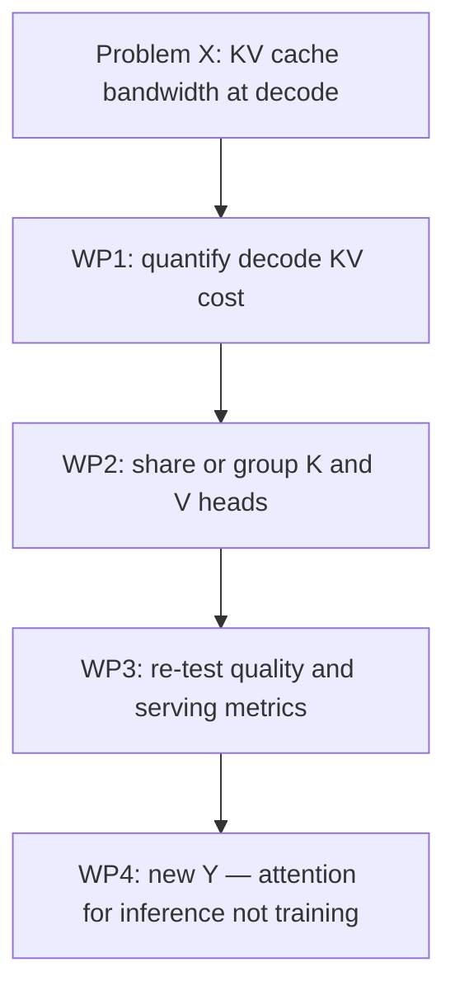
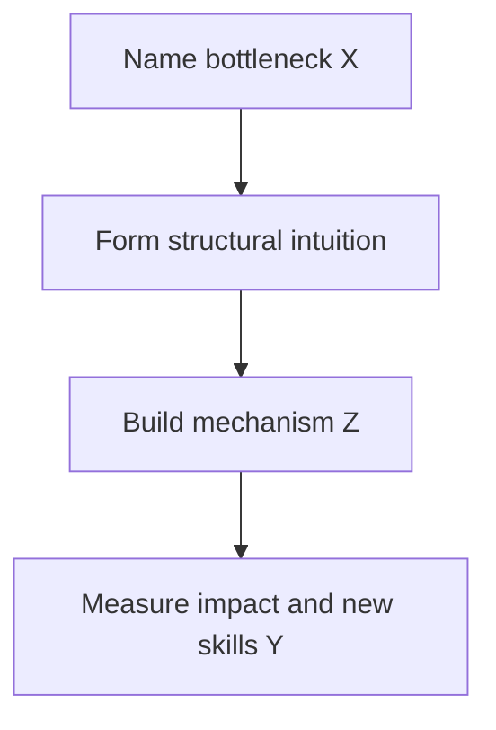

# What is a storyboard

A storyboard is a learning tool where TimeCapsule creates a full research story for learners. We start with a builder/researcher/problem-solver `A` trying to solve problem `X`. We define the skills `Y` that `A` must develop and the tools/actions `Z` that `A` uses. The storyboard is then broken into waypoints where `A` applies `Y` and `Z` to move forward. Waypoints are not optimized for speed; they capture real workflow. In many cases, `A` uses existing `Y` and `Z` to create new `Y` (and sometimes new `Z`).

## Storyboard rules

- `A` is a learner on [First Break AI Roadmap - Step 2](https://thefirehacker.github.io/firstbreakai/roadmap.html).
- Every storyboard must define:
  - `Problem X`
  - `Skills Y`
  - `Tools/Actions Z`
  - `Waypoint sequence`
- If two problems are unrelated, they must be separate storyboards.
- Each board follows this logic: bottleneck -> intuition -> mechanism -> what changed.

---

## Storyboard 1: Sinusoidal positional encoding

### A profile
`A` can run local inference and inspect logits/attention maps, but cannot yet reason about why order information is needed.

### Problem X (bottleneck)
Pure attention has no native sense of token order.

### Research intuition
Inject position without adding recurrence/convolution so training stays parallel.

### Mechanism built
Add sinusoidal positional vectors to token embeddings at input.

### What changed
The model gains sequence order information while preserving Transformer parallelism.

### Skills Y
- Distinguish architecture capability vs inductive bias.
- Explain absolute position encoding in plain language.
- Trace how embedding + position enters the block stack.

### Tools/Actions Z
- Read architecture sections of the Transformer paper.
- Plot or inspect sinusoidal patterns for different positions.
- Run small prompts and compare behavior with/without position signals (conceptual experiment design).

### Waypoint sequence
1. Observe failure mode: order-sensitive sentences collapse without order cues.
2. Learn why attention weights alone do not encode absolute index.
3. Add sinusoidal position vectors and validate that order-sensitive behavior improves.
4. Record new `Y`: ability to explain why sequence models need explicit order signals.

### Waypoint diagram

---

## Storyboard 2: Relative positions (Shaw + Transformer-XL framing)

### A profile
`A` understands absolute position embeddings but sees they are awkward for distance-based language patterns.

### Problem X (bottleneck)
Absolute position is not the right primitive for many pairwise relations.

### Research intuition
Attention is pairwise, so positional information should be pairwise too (relative offsets/distances).

### Mechanism built
Inject relative position representations into attention computations; in Transformer-XL, pair this with recurrence-compatible relative formulation.

### What changed
Models become better at representing local/relative relationships and handling cross-segment context logic.

### Skills Y
- Differentiate absolute vs relative position signals.
- Explain why pairwise scoring aligns with relative distance.
- Reason about context fragmentation at segment boundaries.

### Tools/Actions Z
- Compare attention score formulas conceptually (absolute-additive vs relative-aware).
- Build toy examples using "token k steps left" reasoning.
- Inspect segment boundary effects in language modeling setups.

### Waypoint sequence
1. Spot mismatch: absolute index does not directly encode "how far apart."
2. Reformulate position as relation between query and key positions.
3. Validate improved handling of relative dependencies.
4. Record new `Y`: ability to choose positional primitives based on task structure.

### Waypoint diagram

---

## Storyboard 3: RoPE (Rotary Position Embedding)

### A profile
`A` knows relative position helps, and now asks whether position can be encoded inside Q/K geometry itself.

### Problem X (bottleneck)
Position methods feel bolted on instead of native to attention geometry.

### Research intuition
Encode position by rotating Q/K vectors so dot products naturally carry relative information.

### Mechanism built
Apply position-dependent rotations in paired dimensions of queries and keys.

### What changed
Relative-position effects emerge directly in attention scores with strong practical performance.

### Skills Y
- Explain geometric encoding of position in attention space.
- Connect dot-product behavior to relative-position sensitivity.
- Compare additive-bias methods vs geometric-transformation methods.

### Tools/Actions Z
- Walk through a 2D rotation intuition for one Q/K pair.
- Inspect attention score behavior conceptually as distance increases.
- Map RoPE usage to real model code paths.

### Waypoint sequence
1. Identify friction with external position tags.
2. Move position into Q/K transformation.
3. Validate that attention scoring now carries relative structure more natively.
4. Record new `Y`: ability to reason about representation geometry, not only array shape.

### Waypoint diagram

---

## Storyboard 4: ALiBi (Attention with Linear Biases)

### A profile
`A` is focused on inference length extension and sees models degrade beyond training context.

### Problem X (bottleneck)
Many positional methods extrapolate poorly to longer lengths.

### Research intuition
Do not encode position in token representation; bias attention scores directly by distance.

### Mechanism built
Add a linear distance-based bias term to attention scores (head-dependent slope pattern).

### What changed
Improved length extrapolation behavior with lower complexity overhead.

### Skills Y
- Explain extrapolation vs interpolation in context length.
- Understand where to inject inductive bias: embeddings vs scores.
- Evaluate recency priors and their trade-offs.

### Tools/Actions Z
- Compare perplexity/quality across train length vs test length.
- Plot bias magnitude vs distance for intuition.
- Run long-sequence sanity checks in inference settings.

### Waypoint sequence
1. Detect extrapolation failure with existing positional encoding.
2. Shift positional signal from embeddings to score bias.
3. Evaluate longer-context behavior with minimal architecture change.
4. Record new `Y`: ability to design for deployment constraints, not only training fit.

### Waypoint diagram

---

## Storyboard 5: RoPE extension track (YaRN + LongRoPE)

### A profile
`A` wants to keep RoPE benefits but extend context safely for long-document inference.

### Problem X (bottleneck)
RoPE-based models often degrade sharply beyond trained context length.

### Research intuition
Do not discard RoPE; rescale/interpolate positional geometry more carefully and progressively.

### Mechanism built
Use efficient context-extension recipes (e.g., interpolation/rescaling strategies and staged extension) to preserve short-context quality while extending long-context behavior.

### What changed
Longer usable context windows become feasible with less retraining cost than full-from-scratch alternatives.

### Skills Y
- Diagnose long-context failure modes in RoPE models.
- Understand controlled rescaling of positional geometry.
- Balance short-context retention vs long-context extension.

### Tools/Actions Z
- Run targeted long-context eval suites.
- Compare baseline RoPE vs extension recipe checkpoints.
- Use progressive extension experiments (short -> medium -> long) with quality tracking.

### Waypoint sequence
1. Confirm baseline RoPE degradation beyond train window.
2. Apply context-extension recipe with controlled scaling.
3. Evaluate short-context regression and long-context gains.
4. Record new `Y`: ability to evolve strong mechanisms instead of replacing them blindly.

### Waypoint diagram

---

## Storyboard 6: NoPE (No positional encoding)

### A profile
`A` now questions assumptions and tests whether explicit positional machinery is always necessary.

### Problem X (bottleneck)
Positional methods may be over-engineered for some settings; unclear what bias is truly required.

### Research intuition
Causal masking and optimization dynamics may allow implicit positional information to emerge.

### Mechanism built
Train without explicit positional encodings and analyze learned behavior and length generalization.

### What changed
Reframed the field question from "which positional encoding should we add?" to "what positional bias is minimally necessary?"

### Skills Y
- Form null-hypothesis style experiments in model design.
- Distinguish emergent behavior from explicitly injected structure.
- Reason about limits of implicit position learning.

### Tools/Actions Z
- Ablation runs with and without explicit positional encoding.
- Diagnostic probes for positional information in activations.
- Length-generalization tests under controlled decoding settings.

### Waypoint sequence
1. Remove explicit positional module as a deliberate ablation.
2. Measure what positional behavior still emerges.
3. Identify boundaries where explicit methods are still needed.
4. Record new `Y`: ability to challenge default architecture assumptions.

### Waypoint diagram

---

## Storyboard 7: FlashAttention (separate, unrelated bottleneck)

### A profile
`A` can explain attention math but struggles with real latency/throughput bottlenecks on GPU.

### Problem X (bottleneck)
Attention runtime is heavily constrained by memory IO, not just FLOPs.

### Research intuition
Keep exact attention formula but redesign execution to reduce high-bandwidth memory traffic.

### Mechanism built
Use IO-aware tiling/fusion strategy so Q/K/V blocks are processed with far fewer expensive memory reads/writes.

### What changed
Large practical speedups with exact attention computation and improved long-context usability.

### Skills Y
- Separate algorithmic complexity from systems bottlenecks.
- Explain IO-aware optimization in model-serving context.
- Connect kernel-level design to user-visible latency.

### Tools/Actions Z
- Profile GPU memory traffic and kernel timelines.
- Benchmark baseline attention vs optimized kernels.
- Track throughput/latency trade-offs at different sequence lengths.

### Waypoint sequence
1. Measure that naive attention is memory-traffic dominated.
2. Reframe optimization target from approximation to IO movement.
3. Adopt tiled exact attention kernel and benchmark gains.
4. Record new `Y`: ability to find bottlenecks in implementation, not only equations.

### Waypoint diagram

---

## Storyboard 8: MQA/GQA for KV-cache efficiency (separate, unrelated bottleneck)

### A profile
`A` is now running token-by-token decoding and sees KV cache size/bandwidth dominate inference.

### Problem X (bottleneck)
In decoder inference, loading per-head K/V tensors is expensive in memory bandwidth and cache size.

### Research intuition
Keep multi-head query expressivity but share or group K/V heads to reduce cache overhead.

### Mechanism built
- **MQA:** share one K/V set across all query heads.
- **GQA:** share K/V within groups of query heads as a quality/efficiency middle ground.

### What changed
Substantial inference efficiency gains, making long-context decoding and serving more practical.

### Skills Y
- Model KV-cache memory costs from tensor shapes.
- Evaluate quality vs efficiency trade-offs in head sharing.
- Pick inference-oriented attention variants for deployment constraints.

### Tools/Actions Z
- Compute KV-cache footprint for MHA vs MQA vs GQA.
- Benchmark tokens/sec and latency under identical hardware.
- Run quality regression checks after conversion/uptraining.

### Waypoint sequence
1. Quantify decode-time memory-bandwidth bottleneck.
2. Reduce K/V redundancy via sharing/grouping strategy.
3. Re-test quality and serving metrics at target context lengths.
4. Record new `Y`: ability to redesign attention for inference bottlenecks.

### Waypoint diagram

---

## Cross-board pattern for Step 2 learners

Each breakthrough follows the same research workflow:

1. Find a concrete bottleneck (`X`): order, length, IO, or KV bandwidth.
2. Form an intuition about structure (relative vs absolute, geometry vs additive tags, system IO vs formula).
3. Build a mechanism (`Z`) that encodes that intuition.
4. Measure what changed and extract reusable skills (`Y`) for the next bottleneck.

### Pattern diagram

