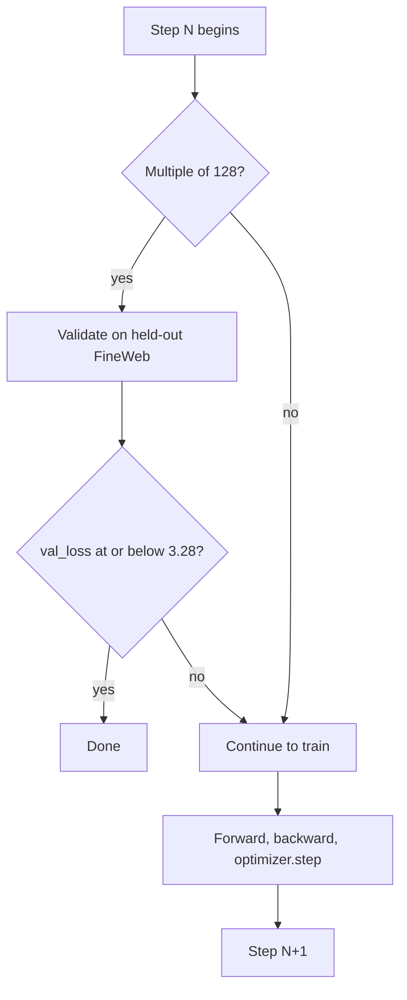

# Your First Baseline Run: What All Those Numbers Mean

*Part of [FBA Lab](https://bubblnet.com/). You just launched step 1 of Tyler Romero's NanoGPT speedrun on Modal. This post walks you through what is happening inside that container.*

You ran the command:

```bash
cd nanogpt-speedrun
modal run src/runfiles/modal_runner.py::train --step 1
```

And now your terminal is filling up with lines like this:

```
step:9213/24576 train_loss:3.3677 train_time:643300ms step_avg:54.84ms tokens_seen:3.86e+09
step:9214/24576 train_loss:3.2021 train_time:643357ms step_avg:54.84ms tokens_seen:3.86e+09
step:9215/24576 train_loss:3.4667 train_time:643414ms step_avg:54.84ms tokens_seen:3.86e+09
step:9216/24576 train_loss:3.2858 train_time:643474ms step_avg:54.84ms tokens_seen:3.86e+09
step:9216/24576 val_loss:3.3843 train_time:643518ms step_avg:54.84ms
step:9217/24576 train_loss:3.3281 train_time:643531ms step_avg:54.84ms tokens_seen:3.86e+09
step:9218/24576 train_loss:3.4684 train_time:643584ms step_avg:54.84ms tokens_seen:3.86e+09
```

Numbers everywhere. Let me walk you through what every one of them means.

---

## All those scrolling numbers

Look at the lines above. Most of them have `train_loss` — that number bouncing between 3.0 and 3.6, never sitting still. Then, right in the middle, there is a different line: one that says `val_loss:3.3843`. Notice it appears at step 9216, then the train lines pick up again at 9217.

These are two different scores, and the difference between them is the single most important thing to understand about this run.

**`train_loss`** is the model's score on the batch of text it just trained on. Think of it like a quiz on the homework you just finished — of course you do well, you just studied that exact material. It is logged every single step, which is why it dominates your terminal. And because each batch is a different slice of internet text — some easy, some hard — the number bounces around. That is normal. A batch of simple Wikipedia sentences might give you 3.0; a batch of dense legal text might spike to 3.6.

**`val_loss`** is the real exam. The model is tested on a completely separate chunk of FineWeb that it has never trained on. No peeking, no second chances. This number only appears every **128 steps** (at step 0, 128, 256, 384, … 9216, 9344, and so on). It is smoother because each val score is the average of about 20 held-out batches, not one noisy sample.

Here is the key insight: **`train_loss` can be 3.0 while `val_loss` is still 3.38.** The model scores well on what it just practiced, but the exam is harder. Only the exam score — `val_loss` — decides when the run ends.

So when you see `train_loss:3.00` and wonder "why didn't it stop?" — now you know. Filter your logs or W&B dashboard for `val_loss`. That is the number tracking real progress.

---

## When does this thing stop?

Two possible endings:

**The good one:** `val_loss` drops to **3.28 or below**. The very first time this happens, training stops immediately. There is no "prove it three times" requirement — one passing exam score is enough. In the code, it is just:

```python
SPEEDRUN_TARGET = 3.28

if val_loss <= SPEEDRUN_TARGET:
    break
```

**The fallback:** if `val_loss` never reaches 3.28, the run stops at step **24,576** — the budget for this baseline recipe.

That 3.28 target is the same number used by Keller Jordan's modded-nanogpt — the official NanoGPT speedrun. The entire competition is about who reaches 3.28 fastest. Tyler's baseline is the slow, honest starting point; later steps in his path add tricks (Muon optimizer, FlexAttention, longer sequences) to get there faster.

---

## What happens on a single step?

Now let me zoom in. What is the script actually doing between one log line and the next?

On a **normal training step**:

1. Load the next batch of tokenized text from FineWeb
2. Run it forward through the GPT-2 model to get a loss
3. Run backward to compute gradients
4. Call `optimizer.step()` — **this is where the weights actually change**
5. Log `train_loss` and move on

Every **128 steps**, the script inserts a detour before training:

1. Switch the model to eval mode (no dropout, no gradient tracking)
2. Run forward on several batches from the **validation** set (about 20 batches)
3. Average those losses into one `val_loss`
4. Check: is `val_loss <= 3.28`? If yes, stop everything. If no, continue with the normal train step above.



That validation detour is why the terminal sometimes pauses for a moment on lines that are multiples of 128. Averaging 20 batches takes longer than a single training step. If the pause lasts a few seconds, that is normal. If it lasts many minutes with no new step appearing, something may have hung — check GPU utilization on Modal's dashboard and look for new points in W&B.

---

## The four W&B charts

Open your Weights & Biases dashboard (the link is in the terminal output). You will see several charts. Here is what each one is telling you.

### val_loss — the scoreboard

This is the chart that matters. It should trend downward over training, heading toward the 3.28 line. It looks smooth because each point is an average of ~20 validation batches, and it only updates every 128 steps.

If this curve is still above 3.28 when it flattens out near the end of training, the baseline did not quite get there. Tyler's worklog reports the baseline reaches about **3.2798** — just barely under the wire, and only after seeing about 6.4 billion tokens.

### train_loss — the heartbeat

Noisy, choppy, jumping around. That is fine. Think of it as a heartbeat — you want to see it moving, generally trending down over thousands of steps, but the beat-to-beat variation is meaningless. You would only worry if it suddenly shot up and stayed high, which would mean something went very wrong with the optimization.

### lr — the learning rate triangle

This chart should look like a lopsided triangle: a short climb on the left, then a long slide to the right.

```text
LR
0.0015 |     /\
       |    /  \
       |   /    \
       |  /      \
       | /        \___________
~0.0001|______________________→ step
       0  256              24576
```

The short climb is **warmup**. Think of it like stretching before a sprint. The model's weights start random — if you immediately take huge optimization steps, the gradients are chaotic and training can blow up. So the learning rate starts near zero and climbs to its peak (0.0015) over the first 256 steps. That gives the model a chance to settle into something reasonable before you crank up the intensity.

After warmup, the learning rate **keeps falling** for the rest of the run — every single step, a little lower. By the end it is about 10% of the peak. The idea is simple: big steps help early when the model is far from any good solution; smaller steps later help it fine-tune without overshooting.

In the code:

```python
# warmup phase: climb from near-zero to peak
if it < args.warmup_iters:
    return args.learning_rate * (it + 1) / args.warmup_iters

# decay phase: slide from peak down to ~10% of peak
decay_ratio = (it - args.warmup_iters) / (args.num_iterations - args.warmup_iters)
return (0.1 + (1 - decay_ratio)) / 1.1 * args.learning_rate
```

If you look at your chart and see that long downward slope — that is supposed to be there.

### grad_norm — the spiky floor

This chart shows the size of the gradient vector before each weight update. You will typically see a spike at the very start (random weights produce wild gradients), then a low, noisy floor with occasional spikes.

```text
grad_norm
  4.0 |*
  2.0 |           *           *        occasional spikes
  1.0 |------------------------------- clip threshold
      |  ****************************  typical range
  0.2 |______________________________→ step
```

The baseline clips gradients at 1.0, but the logged `grad_norm` is the value **before** clipping. So spikes above 1.0 in the chart do not mean the weight update was that large — the actual update was clipped. This is normal.

What would look bad: the norm climbing to 10, 50, 100 and staying there, with loss going haywire at the same time. That would be a sign of training instability. In a healthy run, the floor stays low and the occasional spike is just a hard batch.

---

## Why 8 GPUs but grad_accum is 1

If you look at `run.sh`, you will see `--grad_accum_steps 1`. Tyler's original baseline used `4`. Why the change?

The baseline recipe is designed around a fixed **global batch** of **262,144 tokens** per weight update. That number has to stay the same regardless of how many GPUs you use — otherwise you are training a different model.

The math:

```text
tokens_per_update = batch_size  x  sequence_length  x  num_gpus  x  grad_accum_steps
```

Tyler ran on **2 GPUs**, so he needed 4 accumulation steps to reach 262,144:

```text
32 x 1024 x 2 x 4 = 262,144
```

Our Modal run uses **8 GPUs**, so we only need 1 accumulation step:

```text
32 x 1024 x 8 x 1 = 262,144
```

Same recipe, same global batch, just more GPUs doing the work in parallel instead of accumulating across multiple micro-steps. The script even checks this with an assert — if you accidentally leave `grad_accum_steps` at 4 on 8 GPUs without changing `total_batch_size`, it will crash on startup rather than silently train a different model.

```text
Tyler's 2 GPUs:   [GPU0: micro x4] [GPU1: micro x4]  →  update on 262,144 tokens
Our 8 GPUs:       [GPU0..7: one batch each]           →  update on 262,144 tokens
```

---

## How this compares to Keller's modded-nanogpt

Same target (3.28 on FineWeb), same `grad_accum_steps = 1` on 8 GPUs. But modded-nanogpt auto-computes accumulation from GPU count, ramps its batch size on a schedule instead of keeping it fixed, and includes dozens of optimizations that Tyler's baseline intentionally leaves out. That is the point — Tyler's step 1 is the slow, clear starting line. You will add the tricks in steps 2 through 6.

---

## What to do now

Open W&B and watch the `val_loss` chart. That is the only number that decides when you are done. The noisy `train_loss`, the declining `lr`, the spiky `grad_norm` — they are all signs that training is proceeding normally, but `val_loss` is the finish line.

If the run completes all 24,576 steps without hitting 3.28, it is still a success — Tyler's baseline typically lands around 3.2798, and the next steps in his speedrun path will get there faster.

Ready to go deeper? The full line-by-line breakdown of the training script is in [`tutorial.md`](tutorial.md), the quick version in [`quickstart-train-gpt2.md`](quickstart-train-gpt2.md), and the [FBA Lab roadmap](https://bubblnet.com/) shows where this fits in the bigger picture.
