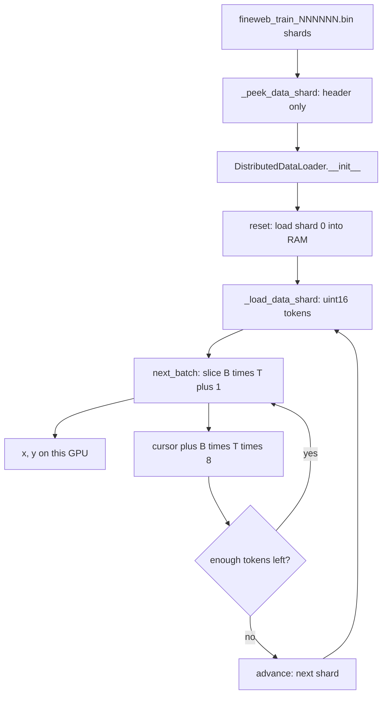

# Baseline Data Loading: Shards, Batches, and the DistributedDataLoader

## What should be the order of explanation

### What i understood ( check this )

`_peek_data_shard`: internal handler function uses np and buffers. checks for magic number, and gives number of tokens mentioned in header. returns number of token

`_load_data_shard`: This one also checks token for number of tokens. This returns the actual tokens

logic is in main after model is compiled DistributedDataLoader is called for both test and val. it calls reset function which calls `_load_data_SHARD`

my assumption is shard is a piece of data and batch is segment within it that need to be fed to the model ( check this too ) next_batch calls advance of next shard is required

batching logic ( explain this properly how are batches selected. on 8 gpus and on each one

class DistributedDataLoader

### Order

I want to understand purpose of batching i understand ddp but now i want a mental picture of data loading batching and sharding what is its need and how is it handled here

---

You already understand DDP: eight copies of the same model, eight different slices of data, gradients averaged, one optimizer step, identical weights again. What that picture still leaves open is **how those eight slices get onto the GPUs**. That is the whole job of this loader. It is not a PyTorch `Dataset`. It is a cursor walking a pre-tokenized integer stream.

Source of truth:

- [`nanogpt-speedrun/src/runfiles/01-Initialbaseline/train_gpt2.py`](../../nanogpt-speedrun/src/runfiles/01-Initialbaseline/train_gpt2.py) — `_peek_data_shard`, `_load_data_shard`, `DistributedDataLoader`
- [`nanogpt-speedrun/src/data/fineweb.py`](../../nanogpt-speedrun/src/data/fineweb.py) — how the `.bin` files are written
- [`nanogpt-speedrun/src/runfiles/01-Initialbaseline/run.sh`](../../nanogpt-speedrun/src/runfiles/01-Initialbaseline/run.sh) — the 8-GPU numbers: `B=32`, `T=1024`, `grad_accum=1`, global batch `262,144` tokens

This is the baseline loader only. Later speedrun steps change I/O (async preload, different `B`/`T`). They do not change the interleaving idea below.

---

## What this note corrects up front

- **Train and val, not test.** After `torch.compile` + `DDP(...)`, two loaders are built: `train_loader` and `val_loader`. There is no test set in this script.
- **`_peek_data_shard` returns a count, not tokens.** It reads only the 1024-byte header, checks magic `20240520` and version `1`, and returns `header[2]`.
- **`_load_data_shard` returns the token array.** Same header checks, then the rest of the file as `uint16` IDs. That array is what `reset()` / `advance()` keep in `self.tokens`.
- **A shard is a file; a batch is not a random segment of it.** A shard is an on-disk token stream (~100M tokens). A batch is a **contiguous cursor window** of `B*T+1` tokens, reshaped to `(B, T)`, then the cursor jumps ahead by `B*T*world_size` so the 8 ranks stay interleaved and non-overlapping. No random sampling.

`next_batch` calling `advance` when the next step would overrun the shard is correct. `__init__` → `reset()` → `_load_data_shard` is also correct. One extra wrinkle: the training loop later calls `train_loader.reset()` again, so the one `next_batch()` taken before the loop is discarded.

---

## 1. Why this machinery exists at all

A GPT training step does not consume English. It consumes two integer tensors `x` and `y`, both shape `(B, T)`, both living on a GPU. `x[i, j]` is a token id. `y[i, j]` is the token that should come next. Cross-entropy is taken over every position. That is the entire contract between “data” and “model.”

Three constraints make that contract hard.

**Compute.** Matrix multiplies want a batch, not a single sequence. One sequence of length 1024 is too little work to keep an H100 busy and too noisy a gradient to train stably. So you stack `B` sequences into one tensor and run them together. That is batching. It exists so the GPU has enough parallel work and so each weight update is an average over more tokens.

**Memory and disk.** FineWeb-10B is about ten billion tokens. At 2 bytes each that is ~20 GB of integers, plus you cannot keep the whole thing on GPU, and you do not want to tokenize HTML during the training step. So the corpus is tokenized **once**, offline, and written to disk as a packed integer stream. Even then you do not `mmap` the entire 20 GB into every process at startup if you can avoid it. You cut the stream into **files** of about 100 million tokens. Those files are shards. Sharding exists so I/O and RAM stay bounded: one file in memory at a time, the rest stay on disk.

**Multi-GPU uniqueness.** DDP only pays for itself if the eight GPUs compute **different** gradients. If they all read the same 32 sequences, you paid for eight GPUs and got one GPU’s worth of data. So the loader must hand each rank a different window of the same stream, and it must do that without a central dispatcher — `torchrun` just starts eight processes, each of which only knows its `RANK` and `WORLD_SIZE`.

Those three constraints are why you have three words: **batch** (compute unit), **shard** (storage unit), **loader** (the cursor that turns a shard into batches and keeps the ranks from colliding). They are not the same thing at different sizes. They solve different problems.

---

## 2. The four scales

Hold these numbers in your head. They are the actual 8-GPU baseline from `run.sh`: `B=32`, `T=1024`, 8 processes, `grad_accum_steps=1`.

| Scale | What it is | Size here |
|---|---|---|
| Corpus | All of FineWeb-10B, already GPT-2 tokenized | ~10B tokens, ~100 train files + 1 val file |
| Shard | One `.bin` file on disk | ~100M tokens (~200 MB of `uint16`) |
| Batch (per GPU) | What one `next_batch()` returns | `32 × 1024 = 32,768` tokens, plus 1 extra for the shift |
| Sequence | One row of that batch | 1024 tokens |

The identity that ties DDP to the loader is:

```
tokens per optimizer step = B × T × world_size × grad_accum
                          = 32 × 1024 × 8 × 1
                          = 262,144
```

That 262,144 is `total_batch_size`. The script asserts it. If you change GPU count and forget to change `B` or `grad_accum`, you are training a different model. On Tyler’s original 2-GPU recipe the same 262,144 was `32 × 1024 × 2 × 4`. Same reading assignment, different number of desks.

A first picture — “shard is a piece of data, batch is a segment within it that gets fed to the model” — is right, with two refinements.

A shard is not an abstract piece. It is **one file**. The loader never “owns” a shard per GPU. All eight ranks load the **same** current file into CPU RAM and then read **different offsets** inside it.

A batch is not a random segment, and it is not “B independent documents.” It is `B*T+1` **consecutive** tokens starting at this rank’s cursor, then reshaped into `B` rows of length `T`. Row 1 of the batch is simply the next 1024 tokens after row 0. Documents were glued together at preprocess time with `<|endoftext|>`. They can start or end in the middle of a row, and they can be split across rows, across batches, and even across shard files.

---

## 3. What is actually on disk

Before training starts, `fineweb.py` (or the HuggingFace cache of the same format) does this once:

1. Download FineWeb documents (raw text).
2. Tokenize each document with the GPT-2 BPE tokenizer (`tiktoken`).
3. Stick token `50256` (`<|endoftext|>`) in front of every document so the model can see “this article ended, a new one begins.”
4. Concatenate everything into one long 1-D array of token ids.
5. Every 100 million tokens, flush that array to a file.

```python
def tokenize(doc):
    # tokenizes a single document and returns a numpy array of uint16 tokens
    tokens = [eot] # the special <|endoftext|> token delimits all documents
    tokens.extend(enc.encode_ordinary(doc["text"]))
    tokens_np = np.array(tokens)
    assert (0 <= tokens_np).all() and (tokens_np < 2**16).all(), "token dictionary too large for uint16"
    tokens_np_uint16 = tokens_np.astype(np.uint16)
    return tokens_np_uint16
```

Shard 0 is written as `fineweb_val_000000.bin`. Every later shard is `fineweb_train_000001.bin`, `000002`, and so on. That is why train and val are different glob patterns, not different code paths.

The file layout is a tiny binary format inherited from Karpathy’s llm.c:

```
[ 1024-byte header ][ N tokens as uint16 ]
```

The header is 256 `int32`s. Only three matter:

```python
header = np.zeros(256, dtype=np.int32)
header[0] = 20240520 # magic
header[1] = 1        # version
header[2] = len(toks) # number of tokens after the 256*4 bytes of header
```

`20240520` is a **magic number** — a format signature, the same idea as `%PDF` at the start of a PDF. It is the date the format was defined, 2024-05-20. It is not a hyperparameter and not a token count. If you point the trainer at a random file, or at an older encoding, this check fails immediately instead of silently interpreting garbage as token ids.

`uint16` is used because the GPT-2 vocabulary is 50,257 ids (the model pads that to 50,304 for kernel alignment). Both fit in 16 bits. Two bytes per token instead of four halves the disk and the memcpy. The model still wants `int64` / `torch.long` on GPU — that conversion happens later, in `next_batch`, not on disk.

One more fact that will matter when we get to batching: a document that does not fit in the remaining space of a shard is **split**. The first half ends one file, the second half opens the next. There is no padding, no “wait for a document boundary.” The token stream is just a stream.

---

## 4. `_peek_data_shard` vs `_load_data_shard`

The useful distinction is **when** they run and **how much of the file** they touch.

### `_peek_data_shard` — read the label, not the box

```python
def _peek_data_shard(filename):
    # only reads the header, returns header data
    with open(filename, "rb") as f:
        # first read the header, which is 256 int32 integers (4 bytes each)
        header = np.frombuffer(f.read(256*4), dtype=np.int32)
    if header[0] != 20240520:
        print("ERROR: magic number mismatch in the data .bin file!")
        ...
        exit(1)
    assert header[1] == 1, "unsupported version"
    ntok = header[2] # number of tokens (claimed)
    return ntok # for now just return the number of tokens
```

`f.read(256*4)` pulls exactly 1024 bytes. `np.frombuffer` does **not** parse text and does **not** copy if it can avoid it. It reinterprets those raw bytes as a length-256 `int32` array sitting on top of the Python `bytes` object. `header[0]` is the first four bytes as a little-endian int32, which should be `20240520`. `header[2]` is the claimed token count.

It returns that count. It does **not** return tokens.

It exists so construction can walk **every** train file, confirm each one is the right format, confirm each one is big enough for one full distributed step, and print `ntok_total` — all without pulling 100 million tokens × ~100 files into RAM. Peeking 1024 bytes × 100 files is cheap. Loading 20 GB is not.

### `_load_data_shard` — pour the box into RAM

```python
def _load_data_shard(filename):
    with open(filename, "rb") as f:
        header = np.frombuffer(f.read(256*4), dtype=np.int32)
        assert header[0] == 20240520, "magic number mismatch in the data .bin file"
        assert header[1] == 1, "unsupported version"
        ntok = header[2] # number of tokens (claimed)
        tokens = np.frombuffer(f.read(), dtype=np.uint16)
    assert len(tokens) == ntok, "number of tokens read does not match header?"
    return tokens
```

Same header dance, then `f.read()` with no size — the rest of the file. Those bytes are reinterpreted as `uint16`. Then the safety check: the header **claimed** `ntok` tokens, and `len(tokens)` **is** `ntok`. If someone truncated the file, or wrote the header wrong, this assert fires.

This returns the actual 1-D numpy array. That array is what the class stores as `self.tokens`. From this point until `advance()` or `reset()`, batching is just slicing that array. No more disk.

So: peek is a metadata probe used at init. Load is a full file read used when a shard becomes the active one. They both check the magic number because they are two doors into the same format, and either door can be pointed at the wrong file.

---

## 5. `DistributedDataLoader` is a cursor, not a dataset

PyTorch’s usual `DataLoader` is a sampler over examples: shuffle, collate, worker processes, pin memory. This class is none of that. It holds four pieces of state and walks forward:

- `self.files` — sorted list of shard paths matching a glob
- `self.current_shard` — index into that list
- `self.tokens` — the numpy array of the **currently loaded** file
- `self.current_position` — integer offset into `self.tokens`, in tokens, not bytes

Plus the constants it was born with: `B`, `T`, `process_rank`, `num_processes`.



### Construction

```python
def __init__(self, filename_pattern, B, T, process_rank, num_processes):
    self.process_rank = process_rank
    self.num_processes = num_processes
    self.B = B
    self.T = T

    self.files = sorted(glob.glob(filename_pattern))
    assert len(self.files) > 0, f"did not find any files that match the pattern {filename_pattern}"

    ntok_total = 0
    for fname in self.files:
        shard_ntok = _peek_data_shard(fname)
        assert shard_ntok >= num_processes * B * T + 1
        ntok_total += shard_ntok
    self.ntok_total = ntok_total
    ...
    self.reset()
```

`sorted(glob.glob(...))` matters. All eight ranks expand the same pattern and sort the same way, so `files[0]` is the same path on every GPU. If the order were filesystem-dependent, ranks would disagree about which shard they were on and the interleaving math would silently desynchronize.

The assert `shard_ntok >= num_processes * B * T + 1` is the “this file is big enough for one full distributed step” check. On this run that is `8 * 32 * 1024 + 1 = 262,145`. A FineWeb shard is ~100M, so it always passes. The `+1` is the extra token needed to build shifted targets. If a shard were smaller than one global step, some rank would try to slice past the end of the array on the first `next_batch()`.

Then `__init__` calls `reset()`, which is the first real load.

### `reset` vs `advance`

```python
def reset(self):
    self.current_shard = 0
    self.current_position = self.process_rank * self.B * self.T
    self.tokens = _load_data_shard(self.files[self.current_shard])

def advance(self): # advance to next data shard
    self.current_shard = (self.current_shard + 1) % len(self.files)
    self.current_position = self.process_rank * self.B * self.T
    self.tokens = _load_data_shard(self.files[self.current_shard])
```

They do almost the same thing. Both load a file. Both set the cursor to `rank * B * T`, which is how rank 0 starts at token 0, rank 1 starts at token `B*T`, rank 7 starts at token `7*B*T`. The only difference is **which file**: `reset` always goes to shard 0, `advance` goes to the next one and wraps with `%` so after the last train file you start over (another epoch, in the naive sense).

`advance` is not called from `main`. It is only called from `next_batch` when the cursor would walk off the end of the current array.

### The `B * grad_accum_steps` trick

This line is easy to miss:

```python
train_loader = DistributedDataLoader(args.input_bin, B * grad_accum_steps, T, ddp_rank, ddp_world_size)
val_loader = None
if args.input_val_bin:
    val_loader = DistributedDataLoader(args.input_val_bin, B, T, ddp_rank, ddp_world_size)
```

The train loader’s `B` is `batch_size * grad_accum_steps`. On this 8-GPU run `grad_accum_steps` is 1, so it is just 32. If you were on 2 GPUs with `grad_accum=4`, the loader would return a fat tensor of shape `(128, 1024)` and the training loop would `chunk` it into four micro-batches of 32. The loader itself does not know about gradient accumulation. It just cuts a wider window. Val is always constructed with the real `B`, because validation does not accumulate.

Two loaders, two independent cursors, two globs (`fineweb_train_*.bin` vs `fineweb_val_*.bin`). Not test.

---

## 6. How one batch is cut

This is the function that actually feeds the model.

```python
def next_batch(self):
    B = self.B
    T = self.T
    buf = self.tokens[self.current_position : self.current_position+B*T+1]
    buf = torch.tensor(buf.astype(np.int32), dtype=torch.long)
    x = (buf[:-1]).view(B, T) # inputs
    y = (buf[1:]).view(B, T) # targets
    self.current_position += B * T * self.num_processes
    if self.current_position + (B * T * self.num_processes + 1) > len(self.tokens):
        self.advance()
    return x.cuda(), y.cuda()
```

Take rank 0 at the start of a shard, `B=32`, `T=1024`. `current_position` is 0. The slice is tokens `[0 : 32769)` — 32,768 tokens plus one extra.

Why plus one? Next-token prediction. If you have a stream `t0 t1 t2 t3`, the model should see `t0 t1 t2` and try to produce `t1 t2 t3`. You need one token more than you have positions.

```
buf  = [ t0  t1  t2  ...  t32767  t32768 ]     length 32769
x    = [ t0  t1  t2  ...  t32767         ]     then .view(32, 1024)
y    = [     t1  t2  ...  t32767  t32768 ]     then .view(32, 1024)
```

So `y[i, j] == x[i, j+1]` inside a row, and at the end of a row `y[i, T-1] == x[i+1, 0]`. The last target of sequence 0 is the first input of sequence 1. The rows are not independent documents. They are adjacent tiles of one stream. That is **sequence packing**. You waste no tokens on padding. You also accept that a document boundary (`<|endoftext|>`) can sit anywhere inside a row, and that the model will still be asked to predict across that boundary — which is actually what you want, because that token is how it learns “new document starts here.”

The `astype(np.int32)` then `torch.long` step is the dtype bridge: disk is `uint16`, embeddings want `int64` indices. Then `.cuda()` copies the two `(32, 1024)` tensors onto this process’s GPU. The rest of `self.tokens` stays on CPU.

After cutting the window, the cursor moves:

```
self.current_position += B * T * self.num_processes
```

Not `+= B*T`. That is the entire distributed trick, and it is the next section.

The overrun check asks: if I stay on this file, will the **next** call to `next_batch` still have `B*T*world_size + 1` tokens left for the farthest rank? If not, call `advance()`, load the next file, and reset this rank’s cursor to `rank * B * T` inside the new file. Leftover tokens at the tail of a shard that cannot form a full 8-GPU step are dropped. That is intentional and cheap — a few tens of thousands of tokens against 100 million.

---

## 7. How 8 GPUs pick non-overlapping slices

This is the part that is easy to get slightly wrong. The GPUs do **not** each own a shard. They do **not** randomly sample. They walk the **same** token stream in lockstep, each permanently offset from the others.

### Tiny numbers first

Pretend `B=2`, `T=4`, so one rank’s batch is 8 tokens, plus 1 extra. Four ranks. The stream is just token indices `0, 1, 2, ...`.

At `reset()`:

```
rank 0 cursor = 0 * 8 = 0
rank 1 cursor = 1 * 8 = 8
rank 2 cursor = 2 * 8 = 16
rank 3 cursor = 3 * 8 = 24
```

Step 0, each rank slices 9 tokens from its cursor and keeps 8 of them as `x`:

```
stream:  0  1  2  3  4  5  6  7 | 8  9 10 11 12 13 14 15 | 16 17 ... | 24 25 ...
         └────── rank 0 ──────┘   └────── rank 1 ──────┘
```

Then every rank does `cursor += 8 * 4 = 32`. They all jump over **everyone’s** slice, not just their own.

Step 1:

```
rank 0 cursor = 32
rank 1 cursor = 40
rank 2 cursor = 48
rank 3 cursor = 56
```

The stream in order of consumption is:

```
step 0: [r0][r1][r2][r3]
step 1: [r0][r1][r2][r3]
step 2: [r0][r1][r2][r3]
...
```

It looks like a zipper. Rank 0 always takes slots `0, 4, 8, ...` in units of `B*T`. Rank 1 always takes `1, 5, 9, ...`. No overlap, no gap (except the dropped tail of a shard), and no communication. Each process only needs to know its own rank.

### Real 8-GPU numbers

`B*T = 32 * 1024 = 32,768` tokens per rank per step.

| Rank | Start of step 0 | Start of step 1 | Start of step 2 |
|---|---|---|---|
| 0 | 0 | 262,144 | 524,288 |
| 1 | 32,768 | 294,912 | 557,056 |
| 2 | 65,536 | 327,680 | 589,824 |
| 3 | 98,304 | 360,448 | 622,592 |
| 4 | 131,072 | 393,216 | 655,360 |
| 5 | 163,840 | 425,984 | 688,128 |
| 6 | 196,608 | 458,752 | 720,896 |
| 7 | 229,376 | 491,520 | 753,664 |

After step 0 the eight ranks have collectively consumed `8 * 32,768 = 262,144` tokens — exactly `total_batch_size`. After step 1 they have consumed 524,288. A 100M-token shard lasts `100,000,000 / 262,144 ≈ 381` optimizer steps, then `advance()` loads the next file and the zipper restarts at the top of that file.

Why this design and not “rank `r` owns files `r, r+8, r+16, ...`”? Because then rank 0 would see a different **distribution** of internet text than rank 7 if the shards were written in crawl order, and because `advance()` would have to be rank-aware. Interleaving inside a shared shard keeps every rank in the same region of the corpus at the same time. Gradients differ because the **windows** differ, not because the **era of the web** differs.

Why not shuffle? Because this is a speedrun loader. Sequential reads from a numpy array already in RAM are as fast as it gets. Shuffle would need an index, a gather, and extra host-device traffic. Later steps in the speedrun change **how** data is prefetched (async I/O, overlapping load with compute). They do not change this interleaving idea.

One subtle consequence: because `view(B, T)` tiles the stream, rank 0’s 32 sequences at step 0 are tokens `0..1023`, `1024..2047`, …, `31744..32767`. Those are 32 adjacent chunks, not 32 randomly chosen articles. Loss on a given step bounces around partly because you just hit a dense legal PDF or a pile of easy boilerplate — the “batch” is a local neighborhood of the crawl, not a representative sample.

---

## 8. How the training loop actually uses it

The precise order in `main` is:

1. `init_process_group`, read `RANK` / `LOCAL_RANK` / `WORLD_SIZE`
2. Build the GPT, `.cuda()`, `torch.compile`, wrap with `DDP`
3. Construct `train_loader` and `val_loader` — each constructor peeks every matching file, then `reset()` loads shard 0
4. `x, y = train_loader.next_batch()` once, **before** the optimizer exists
5. Build AdamW, define the LR schedule
6. `train_loader.reset()` at the top of the training loop — which **rewinds** to shard 0 and discards that prefetch
7. Each step: maybe validate, then `x, y = train_loader.next_batch()`, forward, backward, `optimizer.step()`

```python
model = torch.compile(model)
ddp_model = DDP(model, device_ids=[ddp_local_rank])

# load tokens
train_loader = DistributedDataLoader(args.input_bin, B * grad_accum_steps, T, ddp_rank, ddp_world_size)
val_loader = None
if args.input_val_bin:
    val_loader = DistributedDataLoader(args.input_val_bin, B, T, ddp_rank, ddp_world_size)
x, y = train_loader.next_batch()
```

That pre-loop `next_batch()` is a leftover of a “prefetch the next batch while the GPU works” pattern you will see in later scripts. Here it is immediately undone:

```python
train_loader.reset()
```

so training always starts at the beginning of train shard 0. Harmless, slightly wasteful.

Inside the step, with `grad_accum_steps=1`, the chunk loop runs once and the whole `(32, 1024)` batch is one forward/backward. DDP all-reduces gradients across the eight ranks during `backward()`. Then one `optimizer.step()`. The eight GPUs have now updated on 262,144 distinct tokens.

Validation is a second cursor over a different glob. Every 128 steps:

```python
val_loader.reset()
with torch.no_grad():
    val_loss = 0.0
    for _ in range(args.val_max_steps):
        x_val, y_val = val_loader.next_batch()
        _, loss = ddp_model(x_val, y_val, return_logits=False)
        val_loss += loss.item()
```

`reset()` every time is the point. Validation must re-read the **same** prefix of the val shard so `val_loss` is comparable across steps. If the val loader just kept walking, you would be averaging a moving window of the held-out set and the 3.28 target would become meaningless.

Train never resets inside the loop. It walks the train shards in order, wraps with `%` when it runs out, and that is the whole epoch story. There is no shuffle, no last-partial-batch, no worker pool.

---

## 9. Training objective: next-token prediction

The objective is next-token prediction. For a stream of token ids \(s_0, s_1, \ldots\), the loss at stream offset \(k\) is

\[
\mathcal{L}_k = -\log p_\theta(s_{k+1} \mid s_{\le k})
\]

The batch evaluates that loss at many \(k\) at once and averages. There is no `[MASK]` token written into the input. This is not BERT-style masked language modeling.

`x` and `y` are the same stream, indexed one token apart, then folded to shape `(B, T)`. Let \(p\) be this rank’s `current_position`:

```python
buf = tokens[p : p + B*T + 1]     # length B*T+1
x = buf[:-1].view(B, T)
y = buf[1:].view(B, T)
```

\[
\begin{aligned}
x[i,j] &= s_{p + iT + j} \\
y[i,j] &= s_{p + iT + j + 1}
\end{aligned}
\]

`(i, j)` is an index into the **batch tensor**, not an identity of tokens. The two ids at that index differ by one stream step: \(y[i,j] = x[i, j+1]\) when \(j < T-1\), and \(y[i, T-1] = x[i+1, 0]\) at a row boundary (or the leftover token when \(i = B-1\)). The extra `+1` on `buf` exists so \(y[B-1, T-1]\) still has a defined target.

For a concrete layout, `B=4`, `T=1024` gives two tensors of shape `(4, 1024)`: four packed sequences of length 1024. `x` holds 4,096 ids (what the network reads). `y` holds 4,096 ids (class labels). The stream slice behind them is 4,097 ids. The four rows are consecutive tiles, not four independently sampled documents.

`forward(idx, targets)` uses the two tensors for different jobs.

- `idx` is `x`. It is the only thing embedded (`wte(idx)`), the only thing that receives position ids, the only thing that enters the blocks. Hidden state \(h_{i,j}\) is a function of \(x[i, 0], \ldots, x[i,j]\) because attention is called with `is_causal=True`.
- `targets` is `y`. It never enters `wte`. After `lm_head`, `logits` has shape `(B, T, V)`. Cross-entropy treats `logits[i,j,:]` as a classifier over the vocab and `y[i,j]` as the class index.

Both tensors are moved to the GPU because that `cross_entropy` runs there. Being on the device does not make `y` an input to the net.

The causal mask is required for the objective to be well-defined. \(y[i,j]\) is physically present in `x` at \((i, j+1)\) (or the next row). If position \(j\) could attend to \(j+1\), the target would be visible in the input. Teacher forcing still feeds the ground-truth left context (`x`), not the model’s own previous guesses. What is withheld is only the future, and it is withheld in attention, not by editing `x`.

---

## 10. Local batch, global batch, micro-batch

These three names are easy to collapse. They are not the same size.

A **micro-batch** is one `forward` on one GPU: the whole `(B, T)` tensor. The `B` rows are **one** micro-batch, not `B` micro-batches. If you have 16 sequences and each forward takes 4, that is four micro-batches.

**Local batch** is that same micro-batch, stated in sequences or tokens.

**Global batch** is every token whose gradient is included in the next `optimizer.step()`:

```
global tokens = B × T × num_GPUs × grad_accum
```

Weights change only when `optimizer.step()` runs. Everything before that (`forward`, `backward`) writes `.grad`. “Once per global batch” means: gather the gradient from that full token count, then `step()` once. `zero_grad()`, next global batch, next `step()`.

`step()` waits on `grad_accum`, not on `B`. `B` only says how many sequences sit inside each forward.

When `grad_accum=1`, “once per micro-batch” and “once per global batch” name the **same** `step()`. This rank ran one `(B, T)`, DDP averaged with the other GPUs, then everyone stepped. They only diverge when `grad_accum > 1`: several local forwards, gradients added, then one `step()`.

### Baseline numbers (`grad_accum=1`)

**Local (per GPU, one forward)**

- `B = 32` sequences
- `T = 1024`
- tokens: `32 × 1024 = 32,768`

**Global (one `optimizer.step()`)**

- sequences: `32 × 8 × 1 = 256`
- tokens: `32 × 1024 × 8 × 1 = 262,144`

That 262,144 is `--total_batch_size`. The script’s `B` is the local sequence count.

### Same local shape, `grad_accum=4`

**Local (per GPU, one forward)** — unchanged

- `B = 32` sequences
- `T = 1024`
- tokens: `32 × 1024 = 32,768`

**Global (one `optimizer.step()`)**

- sequences: `32 × 8 × 4 = 1,024`
- tokens: `32 × 1024 × 8 × 4 = 1,048,576`

Each GPU now runs four sequential forwards, then one `step()`. All-reduce still runs on each backward (unless `no_sync` is used on the first three).

If `B`, `T`, and GPU count are held fixed, global batch **does** scale with `grad_accum`. This recipe instead **fixes** global tokens at 262,144 and moves the other factors: Tyler’s 2-GPU run used `grad_accum=4`; this 8-GPU run uses `grad_accum=1`. Same global batch, different split. The script asserts `total_batch_size == B*T*world_size*grad_accum`, so flipping only `grad_accum` to 4 without changing `total_batch_size` fails on startup.

---

## 11. One step on 8 GPUs (`grad_accum=1`)

1. Each GPU already holds its own micro-batch from `next_batch()` — different tokens, same `(B, T)` shape.
2. Forward on all 8, in parallel.
3. Backward on all 8, in parallel. During this, DDP all-reduces gradients so every rank ends with the same averaged `.grad`.
4. `optimizer.step()` on every rank. Same grads, same weight update.
5. `zero_grad()`, then `next_batch()`, and the next step starts.

No extra local forwards in between. The eight micro-batches together are the global batch for that one `step()`.

Batching (`B` rows in one tensor) is a compute/layout choice: those sequences share one kernel launch. Gradient accumulation is a memory workaround: extra sequential forwards when the global token count does not fit in one pass. They are not interchangeable. DDP `world_size` is the third axis — different slices across GPUs.

| Knob | What it parallelizes | Role |
|---|---|---|
| `B` | `B` sequences in one GPU forward | utilization and per-pass gradient quality |
| DDP `world_size` | different slices across GPUs | multi-GPU |
| `grad_accum` | nothing in parallel; extra sequential passes | fit a larger global batch into memory |

---

## 12. Choosing `B` and `T` for a large run

A micro-batch is shaped `(B, T)` because those two knobs do different jobs. For a large run they are picked against VRAM, not as two independent “bigger is better” sliders.

**`T` is the trained context.** In this baseline `T=1024` and `block_size=1024`, so the model only ever sees 1024-token windows. Small `T` is not merely underfilling the GPU; it changes what the model can learn — no dependency past `T`. Later speedrun steps raise `T` (step 6 uses 32,768) only if memory still fits.

**`B` is how many such windows share one forward.** They run as one batched kernel. Small `B` can leave the GPU idle if `T` is also modest: GEMMs like a fat batch dimension. That is not automatic. `B=1`, `T=32k` can still saturate an H100 because attention work grows with `T` (classically \(O(T^2)\) per sequence). Underutilization is a risk when **both** `B` and `T` are small.

They compete for the same memory. Activations scale about `B × T × depth × width`. The usual move is: set `T` to the context you need, then raise `B` until you almost OOM. If `T` is huge, `B` collapses (often to 1). If that local token count is below the global batch you want (`B×T×GPUs×accum`), you add GPUs or `grad_accum`. That third number is independent of what fits on one GPU.

In one line: **`T` is a modeling choice; `B` is a utilization and memory choice; global tokens are an optimization choice.** This baseline landed on `T=1024`, `B=32` per H100, 8 GPUs, `accum=1` → 262,144 tokens per step.

---

## Putting the mental picture back together

The corpus is a river of token ids, written to disk in ~200 MB files so you never have to hold the river. The loader is a bookmark: “I am in file 7, at token 4,194,304.” A batch is what you see if you look at the next 32,769 tokens from that bookmark, tear them into 32 rows of 1024, and shift by one to make targets. Eight bookmarks sit 32,768 tokens apart. After each step they all jump forward 262,144 tokens, so they never land on each other. When a file runs out, every rank opens the next file and sits down at its usual offset from the start.

Each such window is an NTP problem: `x` is the packed prefix side, `y` is the packed next-id side, causal attention keeps the future out of the hidden state. Eight ranks each run one micro-batch, DDP all-reduces, one `optimizer.step()` on 262,144 tokens. That step is the global batch. `B` packed the sequences into one forward; `T` set the context; `grad_accum=1` meant no extra local passes.

Later speedrun steps change the I/O around this (background preload, different `B`/`T`, accumulation math). The baseline idea does not change: one shared stream, one cursor per rank, batches as packed windows, shards as files.
